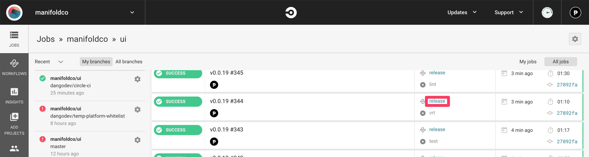
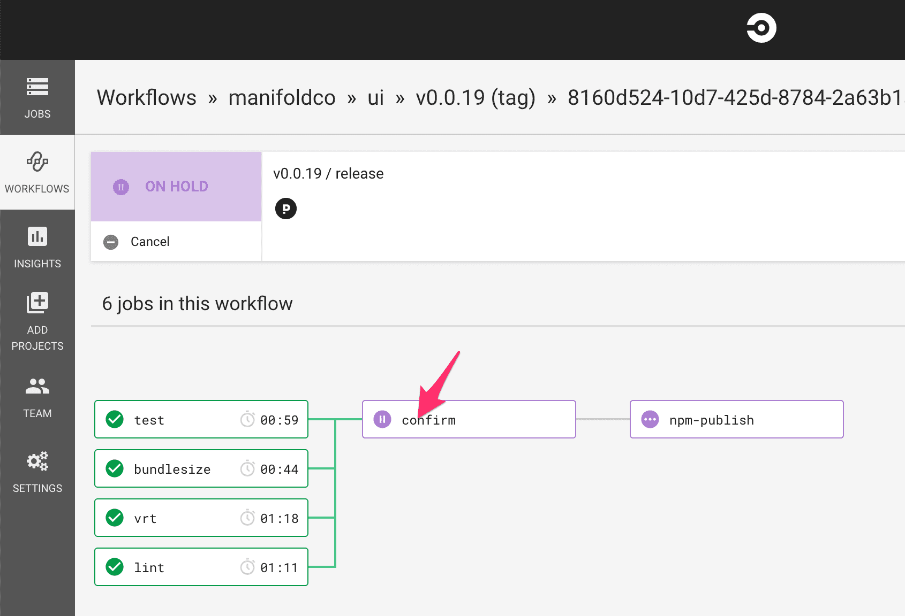

# 🔨 Development

```bash
npm install
npm run dev
```

This will start Storybook at `localhost:6060`. Storybook is the preferred way
to work on styles and testing.

**Note:** When testing the `<manifold-auth-token>` component in Storybook, a fresh token (`manifold_api_token`, available from local storage after a successful login to Dashboard) needs to be manually added to local storage in Storybook. If you don't see the resources you expect after doing this, first check the console and network calls to see if `identity` is returning a 401 Unauthorized response. If this is the case, it's possible your token has expired and you need to set a fresh one in local storage.

Copy these specs from [our specs][specs] into here:

- `src/spec/catalog/v1.yaml`
- `src/spec/gateway/v1.yaml`
- `src/spec/marketplace/v1.yaml`
- `src/spec/provisioning/v1.yaml`

And run `npm run generate:specs`. This is a public repo, but our API specs
aren’t public for now (the types are OK though).

## 📖 Writing stories

Create a new story in `stories/`, or modify an existing one to add it to
Storybook. Testing every version of a component is recommended.

## 📋 Testing

| Command                        | Effect                                                        |
| :----------------------------- | :------------------------------------------------------------ |
| `npm run test [pattern]`       | (slow) Run all unit & E2E tests matching `[pattern]`          |
| `npm run test:e2e [pattern]`   | (slow) Run all E2E tests matching `[pattern]`                 |
| `npm run test:spec [pattern]`  | (fast) Run all unit tests matching `[pattern]`                |
| `npm run test:watch [pattern]` | (fast) Run all unit tests while working, matching `[pattern]` |

## 🖼️ Visual Regression Testing

We use [Happo](https://happo.io/) integrated into our CI pipeline for visual regression testing.

After a PR is made, Happo tests a screenshot of the new PR against a screenshot of the previous version of the same component. If a visual change is detected, the Happo check in the CI pipeline will fail, and it will require human eyes to approve the check.

You can do this by clicking `Details` on a failed Happo check and using the `Review ˅` drop down to Accept or Reject the visual differences you see in the screenshot tests. If the changes are intended PR changes, you can Accept, and if the changes are unexpected you can Reject and the author will be signaled to review their changes.

A passing Happo check means that the test detected no visual changes.

**Note:** Some diffs may be detected based on animations happening in the components. This may be resolved in the future, but as of writing these diffs require human approval.

### Writing Happo Tests

New components that are not yet covered by Happo screenshots should include visual regression test coverage. In order to write a new test, add a file to your component directory titled `[my-component]-happo.ts`, substituting [my-component] with the name of your component.

A simple Happo test just requires the component to be appended to the body of the DOM and exported as a function that returns `componentOnReady()` on the component element:

```js
export const skeleton = () => {
  const details = document.createElement('manifold-resource-details-view');

  document.body.appendChild(details);

  return details.componentOnReady();
};
```

Components that use data can add mocked data to the element objects with the `fromJSON` util:

```js
import resource from '../../spec/mock/cms-stage/resource.json';
import fromJSON from '../../spec/mock/fromJSON';

export const available = () => {
  const status = document.createElement('manifold-resource-status-view');
  status.resourceState = { loading: false, data: fromJSON(resource) };

  document.body.appendChild(status);

  return status.componentOnReady();
};
```

Components that have slots can have the slot elements appended to them using `appendChild` before the element is returned:

```js
import fromJSON from '../../spec/mock/fromJSON';

export const jawsDB = () => {
  const productPage = document.createElement('manifold-product-page');
  productPage.product = fromJSON(jawsdbMock);
  productPage.provider = fromJSON(jawsdbProvider);

  const button = document.createElement('manifold-button');
  button.textContent = 'Get JawsDB MySQL';
  button.slot = 'cta';

  productPage.appendChild(button);
  document.body.appendChild(productPage);

  return productPage.componentOnReady();
};
```

If necessary, tests can be written with HTML as a string and interpolated using the `toHTML` util:

```jsx
import { lock } from '@manifoldco/icons';
import toHTML from '../../../test-utils/to-html';

export const primary = () => {
  const content = `
    <manifold-tooltip label-text="This is a tooltip">
      <span class="value" data-value="42" data-locked>
        <manifold-icon class="icon" icon="${lock}" margin-right></manifold-icon>
        42
      </span>
  `;

  const tooltip = toHTML(content) as HTMLManifoldTooltipElement;
  document.body.appendChild(tooltip);

  return tooltip.componentOnReady();
};
```

Returning on `componentOnReady()` helps ensure the component is hydrated before Happo calculates the bounding rectangle of the screenshot and then captures or tests it.

Use the CLI during test development to create reports that show you the screenshots that will be tested:

| Command             | Effect                                                                    |
| :------------------ | :------------------------------------------------------------------------ |
| `npm run happo dev` | Run a Happo example test that will watch your changes for test iterations |
| `npm run happo`     | Run a Happo example test that will persist                                |

Further examples of Happo tests can be found in their [docs](https://github.com/happo/happo.io/blob/master/README.md#defining-examples).

## 🖋️ Editing documentation

The docs are powered by Gatsby. To preview them locally, run:

```bash
npm run docs
```

That will spin up the docs server locally at `localhost:8000`. Changes will
**not** be hot-loaded from Stencil (it’ll act like a production build).

_Note: when adding a new `*.md` file in `/docs/docs`, it will automatically
hot reload, however it will break if you don’t add a `path` in
[frontmatter][frontmatter]._

## 🚀 Deploying

Not every PR will warrant a release—it’s fine to create & merge PRs into
`master` with the intent that multiple will comprise a release later. But for
PRs that will result in a release, follow the following steps:

<ol>
  <li>
    <strong>Tag</strong> a <a href="#step-1-prerelease">prerelease</a>:
    <br />
    
  </li>
  <li>Test your prerelease <strong>before merging</strong></li>
  <li>Update the <a href="../CHANGELOG.md">CHANGELOG</a>, then <strong>merge</strong></li>
  <li>Once no bugs can be found, publish a <strong>final release</strong> from <code>master</code></li>
</ol>

### Step 1: Prerelease

#### Anatomy of a semver tag

<p align="center">
  
</p>

| Increment | Description                                                                                                                                                                         |
| :-------- | :---------------------------------------------------------------------------------------------------------------------------------------------------------------------------------- |
| **Patch** | Bugfix. There are **no breaking changes** in this release (past `v1.0.0`; expect breaking changes until then).                                                                      |
| **Minor** | New functionality is added. There are also **no breaking changes** in this release, either (past `v1.0.0`; expect breaking changes until then).                                     |
| **Major** | New features (and maybe bugfixes) introduced **with breaking changes** that are documented in the [CHANGELOG][changelog]. This should be installed with caution and plenty of time. |

💁 semver is not a true decimal system (if it wasn’t already apparent from 2
decimals), so each part can go past `.9`. If you’re at `v0.9.0`, the next
logical version **is `v0.10.0`, NOT `v1.0.0`**. Feel free to do into the
double-digits for both minor and patch versions! Also, don’t zero-pad any
numbers.

#### Prelease tagging

**⚠️ Always publish a prerelease before a release!**

A prerelease is a semver with an **npm tag** (the `alpha` in
`v1.2.3-alpha.0`). Prereleases are a vital part of testing, used for both
release candidates as well as experimental releases. Releasing in this way is
highly-encouraged, and poses no risk to our partners.

Here are some commonly-used tags that are good for test releases, but you may
alternately use any word you’d like as long as it’s **not `latest`** (that’s
the tag npm reserves for final version):

| Tag             | Description                                                                                   |
| :-------------- | :-------------------------------------------------------------------------------------------- |
| `v1.2.3-beta.0` | **beta** introduces new features, but there may be some bugs                                  |
| `v1.2.3‑rc.0`   | **release candidate**s are 99.99% ready for stable release; we’re just testing before release |

Prereleases **will not** be downloaded when a user runs `npm install @manifoldco/ui`. It can only be installed by either specifying `npm install @manifoldco/ui@1.0.0-mytag.0` or `npm install @manifoldco/ui@mytag`.

To create a prerelease, either tag a commit on `origin` [in Git][tag-git] or
[in GitHub][tag-github].

##### 💁 Prerelease tips

- Don’t use `-latest` as a tag. That’s the only reserved tag on npm.
- The `Pre-release` checkbox on [GitHub Releases][releases] doesn’t do
  anything; as stated above, only the trailing `-tag` at the end of a version
  will designate a prerelease on npm
- Don’t tag something as `-rc` unless you’re almost ready to release it.
  Don’t use `-rc.1` and `-rc.2` to add new features; only fix bugs.

### Step 2: Testing

In a test app, run `npm install @manifoldco/ui@beta` (or whatever tag you
used) **while your PR is still open.** Ask yourself:

- [ ] Did all dependencies install correctly?
- [ ] Is the change I made working after installing the built package from npm?
- [ ] Are the [docs][docs] up-to-date?
- [ ] Do any [Storybook][storybook] stories need to be written?
- [ ] Do any [Happo tests][happo] need to be written?
- [ ] If applicable, have you [tested against a platform][platform-testing].

If everything looks good and works as expected, **don’t merge your PR yet**!
Update the CHANGELOG (below).

### Step 3. CHANGELOG

Our [CHANGELOG][changelog] is important to keep up-to-date for dependabot,
and other CI tools.

**Only once the CHANGELOG is updated may you merge your PR.**

### Step 4: Final release

<ol>
  <li>
    Decide what the version will be (see <a
    href="#anatomy-of-a-semver-tag">anatomy of a semver tag</a> above). The
    following steps assume that you’ve chosen <code>v1.2.3</code> for your
    new version.
  </li>
  <li>
    Release <code>v1.2.3-rc.0</code>, and <strong>test it fully</strong>
   <ol>
     <li><strong>Bug?</strong> Create a PR, merge, and release the next version: <code>v1.2.3-rc.1</code></li>
     <li>Rinse and repeat (<code>-rc.2</code>, <code>-rc.3</code>, …) until there are no bugs.</li>
    </ol>
  </li>
  <li>
    Once you’re positive there are no bugs or changes needed, <strong>make
    sure all relevant PRs are merged into <code>master</code></strong> and
    tag <code>master</code> with <code>v1.2.3</code>.
  </li>
  <li>
    In CircleCI, navigate to your running jobs and find the
    <code>release</code> job. Click on the word <code>release</code>.
    <br />
    <br />
    
  </li>
  <li>
    You’ll be brought to an approval screen. Click <kbd>confirm</kbd> to
    ensure you want to publish your version (verify the version, too, on that
    screen).
    <br />
    <br />
    
  </li>
</ol>

##### 💁 Release tips

- New releases are available for download at `npm install @manifoldco/ui` (no
  tag). If the user doesn’t specify a version, they’ll download the most recent
  release.
- New releases are also available on our cdn @ `https://js.cdn.manifold.co/@manifoldco/ui` If the user doesn’t specify a version such as `https://js.cdn.manifold.co/@manifoldco/ui@0.5.7`, they’ll download the most recent release.
- Once published, **you can’t unpublish a version;** it’ll be available at
  that version forever. The only way to fix something is to push a new patch
  version.
- 👹 Be warned that **this is now publicly-available!** If any bugs are shipped
  in this version, all our partners sites’ may be broken. Be prepared to deal
  with that before publishing a final release.

[anatomy]: #anatomy-of-a-semver-tag
[changelog]: ../CHANGELOG.md
[docs]: #️-editing-documentation
[git-tag]: https://help.github.com/en/articles/working-with-tags
[happo]: #️-visual-regression-testing
[npm-semver]: https://docs.npmjs.com/misc/semver
[releases]: https://github.com/manifoldco/ui/releases
[specs]: https://github.com/manifoldco/marketplace/tree/master/specs
[storybook]: https://ui.manifold.now.sh
[tag-git]: https://git-scm.com/book/en/v2/Git-Basics-Tagging
[tag-github]: https://github.com/manifoldco/ui/releases
[swagger-to-ts]: https://www.npmjs.com/package/@manifoldco/swagger-to-ts

### CDN

We publish our UI package to our CDN: `https://js.cdn.manifold.co`.

In any setup, you can use our CDN for UI:
```
https://js.cdn.manifold.co/@manifoldco/ui/       # latest (beware of breaking changes!)
https://js.cdn.manifold.co/@manifoldco/ui@0.5.7/ # specific version
https://js.cdn.manifold.co/@manifoldco/ui@0.5.7-alpha.0/ # specific version for alpha
```

## 💁 Tips

### Attributes vs Properties

An important concept to understand when working with web components is the
differences between an HTML attribute and a DOM node property. A simple
example would involve an input element:

```html
<input type="text" value="" />
```

Imagine a user typed something into that box. If we ran the following
functions in a browser console, we’d get the following:

```js
document.querySelector('[type=text]').value;
// "Sarah Anderson"
document.querySelector('[type=text]').getAttribute('value');
// ""
```

In the DOM, the `value` _attribute_ didn’t update, but as the user typed, the
node’s `.value` _property_ did. The difference between attributes and
properties are that properties exist in the browser’s memory, and attributes
exist in the DOM.

#### Applying it to Stencil

Stencil treats attributes & properties very differently, especially within
JSX. Consider the two **in JSX**:

```jsx
// Stencil JSX

<user-card user-info={user} /> // 🚫
<user-card userInfo={user} /> // ✅
```

Within Stencil, `user-info` is the attribute, `userInfo` the property. Use
`user-info` if you’d like to treat it as HTML (strings only), or `userInfo`
if you’d like it to be executed as JavaScript (objects, arrays, numbers,
booleans only supported in this way).

However, when dealing with HTML, it’s totally different—only attributes are
supported (this means only strings!):

```jsx
// HTML

<user-card user-info={user} /> // ✅
<user-card userInfo={user} /> // 🚫
```

Outside Stencil, `user-info` and `userInfo` are **both attributes**, and can
only handle strings. However, because HTML is case-insensitive, `userInfo`
will be treated as `userinfo` (no hyphen).

To use non-strings outside of Stencil, you’ll have to do so [via
JS][stencil-properties].

**TL;DR use `camelCase` in JSX; `kebab-case` in HTML.**

[frontmatter]: https://jekyllrb.com/docs/front-matter/
[specs]: https://github.com/manifoldco/marketplace/tree/master/specs
[stencil-properties]: https://stenciljs.com/docs/properties
[platform-testing]: https://app.gitbook.com/@manifold/s/engineering/playbooks/testing-your-code-against-a-platform
