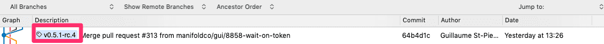
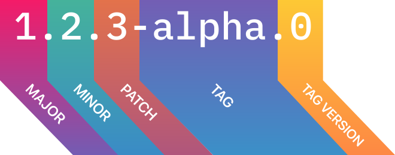

# 🔨 Development

```bash
npm install
npm run dev
```

This will start Storybook at `localhost:6060`. Storybook is the preferred way
to work on styles and testing.

**Note:** When testing the `<manifold-auth-token>` component in Storybook, a fresh token (`manifold_api_token`, available from local storage after a successful login to Dashboard) needs to be manually added to local storage in Storybook. If you don't see the resources you expect after doing this, first check the console and network calls to see if `identity` is returning a 401 Unauthorized response. If this is the case, it's possible your token has expired and you need to set a fresh one in local storage.

Copy these specs from [our specs][specs] into here:

- `src/spec/catalog/v1.yaml`
- `src/spec/gateway/v1.yaml`
- `src/spec/marketplace/v1.yaml`
- `src/spec/provisioning/v1.yaml`

And run `npm run generate:specs`. This is a public repo, but our API specs
aren’t public for now (the types are OK though).

## 📖 Writing stories

Create a new story in `stories/`, or modify an existing one to add it to
Storybook. Testing every version of a component is recommended.

## 📋 Testing

| Command                        | Effect                                                        |
| :----------------------------- | :------------------------------------------------------------ |
| `npm run test [pattern]`       | (slow) Run all unit & E2E tests matching `[pattern]`          |
| `npm run test:e2e [pattern]`   | (slow) Run all E2E tests matching `[pattern]`                 |
| `npm run test:spec [pattern]`  | (fast) Run all unit tests matching `[pattern]`                |
| `npm run test:watch [pattern]` | (fast) Run all unit tests while working, matching `[pattern]` |

## 🖼️ Visual Regression Testing

We use [Happo](https://happo.io/) integrated into our CI pipeline for visual regression testing.

After a PR is made, Happo tests a screenshot of the new PR against a screenshot of the previous version of the same component. If a visual change is detected, the Happo check in the CI pipeline will fail, and it will require human eyes to approve the check.

You can do this by clicking `Details` on a failed Happo check and using the `Review ˅` drop down to Accept or Reject the visual differences you see in the screenshot tests. If the changes are intended PR changes, you can Accept, and if the changes are unexpected you can Reject and the author will be signaled to review their changes.

A passing Happo check means that the test detected no visual changes.

**Note:** Some diffs may be detected based on animations happening in the components. This may be resolved in the future, but as of writing these diffs require human approval.

### Writing Happo Tests

New components that are not yet covered by Happo screenshots should include visual regression test coverage. In order to write a new test, add a file to your component directory titled `[my-component]-happo.ts`, substituting [my-component] with the name of your component.

A simple Happo test just requires the component to be appended to the body of the DOM and exported as a function that returns `componentOnReady()` on the component element:

```js
export const skeleton = () => {
  const details = document.createElement('manifold-resource-details-view');

  document.body.appendChild(details);

  return details.componentOnReady();
};
```

Components that use data can add mocked data to the element objects with the `fromJSON` util:

```js
import resource from '../../spec/mock/cms-stage/resource.json';
import fromJSON from '../../spec/mock/fromJSON';

export const available = () => {
  const status = document.createElement('manifold-resource-status-view');
  status.resourceState = { loading: false, data: fromJSON(resource) };

  document.body.appendChild(status);

  return status.componentOnReady();
};
```

Components that have slots can have the slot elements appended to them using `appendChild` before the element is returned:

```js
import fromJSON from '../../spec/mock/fromJSON';

export const jawsDB = () => {
  const productPage = document.createElement('manifold-product-page');
  productPage.product = fromJSON(jawsdbMock);
  productPage.provider = fromJSON(jawsdbProvider);

  const button = document.createElement('manifold-button');
  button.textContent = 'Get JawsDB MySQL';
  button.slot = 'cta';

  productPage.appendChild(button);
  document.body.appendChild(productPage);

  return productPage.componentOnReady();
};
```

If necessary, tests can be written with HTML as a string and interpolated using the `toHTML` util:

```jsx
import { lock } from '@manifoldco/icons';
import toHTML from '../../../test-utils/to-html';

export const primary = () => {
  const content = `
    <manifold-tooltip label-text="This is a tooltip">
      <span class="value" data-value="42" data-locked>
        <manifold-icon class="icon" icon="${lock}" margin-right></manifold-icon>
        42
      </span>
  `;

  const tooltip = toHTML(content) as HTMLManifoldTooltipElement;
  document.body.appendChild(tooltip);

  return tooltip.componentOnReady();
};
```

Returning on `componentOnReady()` helps ensure the component is hydrated before Happo calculates the bounding rectangle of the screenshot and then captures or tests it.

Use the CLI during test development to create reports that show you the screenshots that will be tested:

| Command             | Effect                                                                    |
| :------------------ | :------------------------------------------------------------------------ |
| `npm run happo dev` | Run a Happo example test that will watch your changes for test iterations |
| `npm run happo`     | Run a Happo example test that will persist                                |

Further examples of Happo tests can be found in their [docs](https://github.com/happo/happo.io/blob/master/README.md#defining-examples).

## 🖋️ Editing documentation

The docs are powered by Gatsby. To preview them locally, run:

```bash
npm run docs
```

That will spin up the docs server locally at `localhost:8000`. Changes will
**not** be hot-loaded from Stencil (it’ll act like a production build).

_Note: when adding a new `*.md` file in `/docs/docs`, it will automatically
hot reload, however it will break if you don’t add a `path` in
[frontmatter][frontmatter]._

## 🚀 Deploying

Not every PR will warrant a release—it’s fine to create & merge PRs into
`master` with the intent that multiple will comprise a release later. But for
PRs that will result in a release, follow the following steps:

<ol>
  <li>
    <a href="https://github.com/manifoldco/ui/releases">Tag a <strong>prerelease</strong> in GitHub</a> with a valid <strong>semver</strong> like so:
    
  </li>
  <li>Test your prerelease <strong>before merging</strong></li>
  <li>Update the <a href="../CHANGELOG.md">CHANGELOG</a>, then <strong>merge</strong></li>
  <li>Once no bugs can be found, publish a <strong>final release</strong> from <code>master</code></li>
</ol>

### Step 1: prerelease

#### Anatomy of a semver tag

<p align="center">
  
</p>

| Increment | Description                                                                                                                                                                                                             |
| :-------- | :---------------------------------------------------------------------------------------------------------------------------------------------------------------------------------------------------------------------- |
| **Patch** | There are **no breaking changes** in this release; this is just a bugfix or minor quality improvement that can safely be pushed to every platform.                                                                      |
| **Minor** | There are **some breaking changes** in this release that are well-documented in the [CHANGELOG][changelog]. Large bugs, or bigger improvements are shipped in this version, but the overall structure remains the same. |
| **Major** | Huge, sweeping changes were made with **many breaking changes** that are documented in the [CHANGELOG][changelog]. This could even mean a full rewrite. This should be installed with caution and plenty of time.       |

💁 semver is not a true decimal system (if it wasn’t already apparent from 2
decimals), so each part can go past `.9`. If you’re at `v0.9.0`, the next
logical version **is `v0.10.0`, NOT `v1.0.0`**. Feel free to do into the
double-digits for both minor and patch versions! Also, don’t zero-pad any
numbers.

#### Prelease tagging

**⚠️ Always publish a prerelease before a release!**

Tagging a prerelease is a vital part of testing. Use tagged prereleases both
for release candidates as well as experimental releases. Releasing in this
way is highly-encouraged, and poses no risk to our partners.

Here are some commonly-used tags that are good for test releases, but you may
alternately use any word you’d like as long as it’s **not `latest`** (that’s
the tag npm reserves for final version):

| Tag              | Description                                                                                   |
| :--------------- | :-------------------------------------------------------------------------------------------- |
| `v1.2.3‑alpha.0` | **alpha** is an experimental version that may not ever be shipped, but we’re using it to test |
| `v1.2.3‑rc.0`    | This is a **release candidate** that is 99.99% complete; we’re just testing before release    |

Prereleases **will not** be downloaded when a user runs `npm install @manifoldco/ui`. It can only be installed by either specifying `npm install @manifoldco/ui@1.0.0-mytag.0` or `npm install @manifoldco/ui@mytag`.

💁 Remember: **don’t use `-latest` as a tag!** That’s the only reserved tag on npm.

### Step 2: testing

Install `@manifoldco/ui@mytag` in the client you’re consuming it in **while your PR
is still open.** Ask yourself:

- [ ] Did all dependencies install correctly?
- [ ] Is the change I made working after installing the built package from npm?
- [ ] Are the [docs][docs] up-to-date?
- [ ] Do any [Storybook][storybook] stories need to be written?
- [ ] Do any [Happo tests][happo] need to be written?

If everything looks good and works as expected, **don’t merge your PR yet**!
Update the CHANGELOG (below).

### Step 3. CHANGELOG

Our [CHANGELOG][changelog] is important to keep up-to-date for dependabot,
and other CI tools.

**Only once the CHANGELOG is updated may you merge your PR.**

### Step 4: final release

1. Decide what the version will be (see [anatomy of a semver tag][anatomy] above). The following steps assume that you’ve chosen `v1.2.3` for your new version.
1. [Release `v1.2.3-rc.0`][releases], and **test it fully**
   1. **Bug?** Create a PR, merge, and [release][releases] the next version: `v1.2.3-rc.1`
   1. Rinse and repeat (`-rc.2`, `-rc.3`, …) until there are no bugs.
1. Once you’re positive there are no bugs or changes needed, **make sure all relevant PRs are merged into `master`** and tag `master` in GitHub with `v1.2.3`.

Once tagged, this will be accessible for download at `npm install @manifoldco/ui`.

👹 Be warned that **this is now publicly-available!** If any bugs are shipped
in this version, all our partners sites’ may be broken. Be prepared to deal
with that before publishing a final release.

[anatomy]: #anatomy-of-a-semver-tag
[changelog]: ../CHANGELOG.md
[docs]: #️-editing-documentation
[git-tag]: https://help.github.com/en/articles/working-with-tags
[happo]: #️-visual-regression-testing
[npm-semver]: https://docs.npmjs.com/misc/semver
[releases]: https://github.com/manifoldco/ui/releases
[specs]: https://github.com/manifoldco/marketplace/tree/master/specs
[storybook]: https://ui.manifold.now.sh
[swagger-to-ts]: https://www.npmjs.com/package/@manifoldco/swagger-to-ts

## 💁 Tips

### Attributes vs Properties

An important concept to understand when working with web components is the
differences between an HTML attribute and a DOM node property. A simple
example would involve an input element:

```html
<input type="text" value="" />
```

Imagine a user typed something into that box. If we ran the following
functions in a browser console, we’d get the following:

```js
document.querySelector('[type=text]').value;
// "Sarah Anderson"
document.querySelector('[type=text]').getAttribute('value');
// ""
```

In the DOM, `value=""` didn’t update, but as the user typed, the node’s
`.value property updated to reflect the user’s status.

#### Applying it to Stencil

Stencil treats attributes & properties very differently, especially within
JSX. Consider the two **in JSX**:

```jsx
<user-card user-info={user} /> // 🚫
<user-card userInfo={user} /> // ✅
```

Of the two, the `kebab-case` one is an HTML attribute. As such, Stencil will
do its best to try and figure out what you meant, but this isn’t meant for
nested objects, and **it won’t receive updates.**

However, when dealing with HTML, it’s totally different—only attributes are
supported (this means only strings!):

```jsx
<user-card user-info={user} /> // ✅
<user-card userInfo={user} /> // 🚫
```

In this example, `userInfo` is actually converted to `userinfo` (HTML is
case-insensitive), so it’s a different prop. Also, if you want to set
non-strings, you’ll have to do so [via JS][stencil-properties].

**TL;DR use `camelCase` in JSX; `kebab-case` in HTML.**

[frontmatter]: https://jekyllrb.com/docs/front-matter/
[specs]: https://github.com/manifoldco/marketplace/tree/master/specs
[stencil-properties]: https://stenciljs.com/docs/properties
